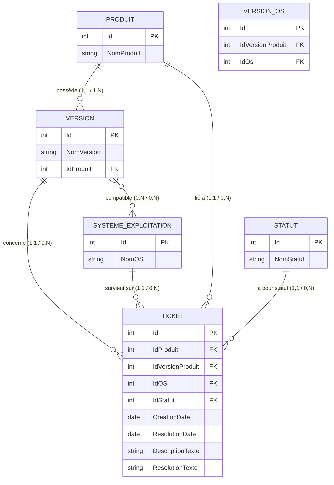

# 06-NexaWorks-BackEnd

Projet back-end réalisé dans le cadre de la formation **Développeur back-end .NET** (OpenClassrooms).

L'objectif est de concevoir et implémenter une base de données de tickets de support pour l'entreprise fictive **NexaWorks**, en utilisant l'approche **Code First** avec Entity Framework Core.

---

## Description du projet

NexaWorks édite plusieurs produits logiciels disponibles sur différents systèmes d'exploitation. Ce projet met en place :

- Un **modèle entité-association** (MCD) pour modéliser les tickets de support
- Une **base de données SQL Server** générée via les migrations EF Core
- Un **jeu de données de test** (25 tickets) inséré via un système de Seeders
- Des **requêtes LINQ** paramétrables pour interroger la base de données

---

## Modèle Entité-Association (MCD)


---

## Installation et configuration

### Prérequis

- [.NET 8 SDK](https://dotnet.microsoft.com/download)
- [SQL Server LocalDB](https://learn.microsoft.com/fr-fr/sql/database-engine/configure-windows/sql-server-express-localdb) (inclus avec Visual Studio)
- [Visual Studio 2022](https://visualstudio.microsoft.com/fr/) ou supérieur
- [LinqPad 9](https://www.linqpad.net/) pour exécuter les requêtes LINQ

### 1. Cloner le repository

```bash
git clone https://github.com/Langlois-j/06-NexaWorks-BackEnd.git
cd 06-NexaWorks-BackEnd
```

### 2. Configurer la connexion à la base de données

 Le fichier `appsettings.json` n'est pas versionné pour des raisons de sécurité.

Créer un fichier `appsettings.json` dans le dossier `06-NexaWorks-BackEnd/` :

```json
{
  "ConnectionStrings": {
    "DefaultConnection": "Server=(localdb)\\MSSQLLocalDB;Database=NexaWorksBackEnd;Trusted_Connection=True;TrustServerCertificate=True;"
  },
  "Logging": {
    "LogLevel": {
      "Default": "Information",
      "Microsoft.AspNetCore": "Warning"
    }
  },
  "AllowedHosts": "*"
}
```

### 3. Appliquer les migrations

```bash
cd 06-NexaWorks-BackEnd
dotnet ef database update
```

### 4. Lancer l'application

```bash
dotnet run
```

Au premier démarrage, le **DataSeeder** insère automatiquement les données de test :
- 6 systèmes d'exploitation
- 4 produits et 12 versions
- 2 statuts
- 25 tickets de support

---

## Requêtes LINQ

Les requêtes se trouvent dans le dossier `Requettes/` et s'ouvrent avec **LinqPad 9**.

### Configuration LinqPad

Les requêtes utilisent le mode **C# Statement(s)** avec `.Dump()`.

Après ouverture d'un fichier `.linq`, configurer la connexion :
```
Connection → Add connection
→ SQL Server (LINQ to SQL)
→ Server : (localdb)\MSSQLLocalDB
→ Database : NexaWorksBackEnd
```

### Fichiers disponibles

| Fichier | Statut fixe | Cas d'usage couverts |
|---|---|---|
| `ToutEnUn.linq` | Paramétrable | 20 combinaisons |
| `Encours.linq` | En cours (Id=1) | 10 combinaisons |
| `Resolut.linq` | Résolu (Id=2) | 10 combinaisons |

### Paramètres disponibles

```csharp
int? statutId = 1;                              // 1=En cours, 2=Résolu, null=tous
int? produitId = null;                          // null=tous les produits
int? versionId = null;                          // null=toutes les versions
DateOnly? ouvertureDateDebutPeriode = null;     // Date création minimale
DateOnly? ouvertureDateFinPeriode = null;       // Date création maximale
string? ouvertureMotCle = null;                 // Mot-clé dans la description
DateOnly? fermetureDateDebutPeriode = null;     // Date résolution minimale
DateOnly? fermetureDateFinPeriode = null;       // Date résolution maximale
string? fermetureMotCle = null;                 // Mot-clé dans la résolution
```

---

## Restaurer la base de données

Un dump complet est disponible dans le fichier `NexaWorksBackEnd.bak`.

Pour le restaurer dans SSMS :
```
Clic droit sur "Bases de données"
→ Restaurer la base de données...
→ Source : Appareil → sélectionner NexaWorksBackEnd.bak
→ OK
```
